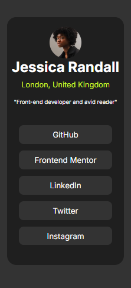

# Frontend Mentor - Social links profile solution

This is a solution to the [Social links profile challenge on Frontend Mentor](https://www.frontendmentor.io/challenges/social-links-profile-UG32l9m6dQ). Frontend Mentor challenges help you improve your coding skills by building realistic projects. 

## Table of contents

- [Overview](#overview)
  - [The challenge](#the-challenge)
  - [Screenshot](#screenshot)
  - [Links](#links)
- [My process](#my-process)
  - [Built with](#built-with)
  - [What I learned](#what-i-learned)
  - [Continued development](#continued-development)
  - [Useful resources](#useful-resources)
- [Author](#author)
- [Acknowledgments](#acknowledgments)

## Overview

### The challenge

Users should be able to:

- See hover and focus states for all interactive elements on the page

### Screenshot

### Links

- Solution URL: [Frontend Mentor Social Media Links Challenge](https://www.frontendmentor.io/solutions/social-links-profile-z-NGxXSc3a)
- Live Site URL: [Social Media Links](https://arize99.github.io/social-links-profile/)

## My process

### Built with

- CSS custom properties
- Flexbox
- CSS Grid
- Mobile-first workflow

### What I learned

I learned how to centre a contianer div.

### Continued development

I will continue to develop in positioning elements with css and responsive designs.

## Author

- Website - [Arize Nnonyelu](https://arizennonyelu.xyz)
- Frontend Mentor - [@arize99](https://www.frontendmentor.io/profile/arize99)
- Twitter - [@upgrade1010](https://www.twitter.com/upgrade1010)

## Acknowledgments

I want to appreciate the open-source community, stackoverflow, frontendmentor, the dev commnunity and search engines for their contributions.
